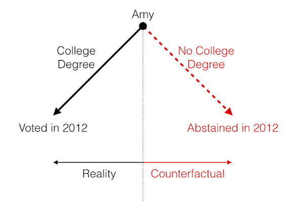

# Questions {#questions}

> "The best scientists and explorers have the attributes of kids! They ask questions and have a sense of wonder. They have curiosity. 'Who, what, where, why, when, and how!' They never stop asking questions, and I never stop asking questions, just like a five year old." ---Sylvia Earle, marine biologist 

See also a relevant xkcd [comic](https://xkcd.com/242/).

In political science, we ask a lot of questions about politics, such as these questions about marriage equality:

- Should gay and lesbian couples have the same right to marry as heterosexual couples?
- What percent of the public supports marriage equality for gays and lesbians?
- What explains the recent increase in support for marriage equality?

Or these questions about income inequality:

- Should the government redistribute wealth?
- Is income inequality higher or lower in the U.S. than France?
- What are the consequences of income inequality?

In answering these questions, we might make *claims* about politics. Claims are just answers to questions. We might make the following claims about marriage equality:

- Gay and lesbian couples should have the same right to marry as heterosexual couples.
- 54% of the public supports marriage equality.
- Court decisions explain the recent increase in support for marriage equality.

Or we might make these claims about income inequality:

- The government should not redistribute wealth.
- Income inequality is higher in the U.S. than France.
- Income inequality causes a slower growth rate.

Political science is all about *asking* and *answering* questions. But the best approach to answering a question depends on the type of question.

I break the questions we might ask (or claims we might make) about politics into three types: normative, descriptive, and causal. Answering each type question requires a different approach.

Type  | Description | Marriage Example | Inequality Example | Approach
------------- | ------------- | ----------- | ----------------- | ---------
normative  | How *should* the world look? Asks for a moral judgement. | Should gay and lesbian couples have the same right to marry as heterosexual couples? | Should the government redistribute wealth? | logic and reasoning
descriptive  | How *does* the world look? Asks for an empirical observation. | What percent of the public supports marriage equality for gays and lesbians? | Is income inequality higher or lower in the U.S. than France? | observation and measurement
causal | *Why* does the world look the way it does? What *influences* X? Asks for a *cause*-and-*effect* relationship or an *explanation*. | What explains the recent increase in support for marriage equality? | What are the consequences of income inequality? | observation and measurement, plus clever design

## Normative Questions

Normative questions ask: "What *should* the world look like?"

In my experience, most people associate political science with normative questions. When I tell people that I'm a political scientist, they tend to ask me normative questions. 

1. "You don't think we should invade Iran, do you?" (Asking for a moral judgement about foreign policy.)
1. "What do you think about the breakdown of the family in the U.S?" (Implicitly asking for a moral judgement about social policy, i.e., "Shouldn't the government adopt more pro-family policies?") 
1. "Don't you think we're rewarding laziness?" (Implicitly asking for a moral judgement about economic policy, i.e., "We shouldn't be doing that, should we?".)

These are normative questions, if perhaps somewhat ill-formed. They are important questions. Some political scientists, called "political philosophers" or "normative political theorists," focus on these types of questions. 

Some important questions asked by normative political theorists include:

1. Should the state redistribute wealth?
1. Under what conditions is war justified?
1. What types of behavior should the state regulate?
1. How should states make policy?

We will not focus on these types of questions.

However, we all bring normative views with us, and these views are helpful. Normative views can motivate us to focus on certain descriptive and causal questions. For example, perhaps you believe that democracy is the most normatively desirable form of government. This might lead you to describe how well democracy works in the U.S. (descriptive) or explain why some countries remain authoritarian (causal). Perhaps you believe that governments should not torture. This might lead you to describe the extent to which certain states use torture (descriptive) or the types of institutional arrangements (independent courts?) that reduce torture (causal).

Reversing the cycle, answers to descriptive and causal questions might inform our normative views. For example, if you know that a majority of the U.S. public supports marriage equality, then you might think the U.S. should allow gays and lesbians to marry. If you know that income equality reduces economic growth, then perhaps you think the U.S. should adopt a more redistributive economic policy.

Normative questions can motivate descriptive and causal questions. Descriptive and causal questions can inform normative debates. But it is important to draw a sharp distinction between normative questions and descriptive/causal questions, because the two require completely different approaches. 

For this class, we'll not focus at all on normative questions. Instead, we'll focus on descriptive and causal questions.

## Descriptive Questions

Descriptive questions ask: "What *does* the world look like? "

Descriptive questions ask for simple observations---a description of the world. 

For example, we might want to ask the following questions:

1. How many chambers does the Swedish legislature have?
1. What percent of voters voted for Barack Obama in 2008?
1. How many political parties are there in the United Kingdom?
1. What percent of countries today are democracies? How has this changed over time?
1. What percent of eligible voters actually voted in the U.S. in 2010? How does this compare with turnout in other countries?
1. What percent of states allow same-sex marriage?
1. How polarized is the U.S. Congress? How has this changed over time?

Answering these questions requires some sort of conceptualization (i.e., what do we mean by "polarized"?) and measurement (i.e., how can we quantify "polarization"?). But all that is required is observation. All we need to do make the appropriate measurements (i.e., gather data).

## Causal Questions

Causal questions ask: "*Why* does the work look the way it does?"

Causal questions ask about a cause or an effect. They ask for an explanation--*why* did something happen? We might be interested in the following causal questions:

1. Why is income inequality so high in the U.S.? Why is it growing so fast at the moment?
1. What causes war between two countries?
1. Why do some states become democratic while others remain authoritarian?
1. What is the effect of an independent court of last resort?
1. What explains low turnout in the U.S.?
1. Why do some countries have many political parties and other countries have few?
1. Why does policy change rapidly in some times and/or places, but slowly in others?
1. Does presidentialism cause democratic failure?

Causal questions and claims are about action. We have one variable acting on another. There are lots of verbs that summarize action: causes, influences, affects, changes, increases, decreases, etc. Causal questions ask us to use these sorts of verbs to describe the way the world works.

### Meaning

We use the word "cause" quite a bit in everyday language. We might say, for example, that smoking *causes* cancer. In making causal claims about politics, we might say things like "wealth *causes* democracy" or "education *causes* turnout." 

But what do these causal claims really mean? What does it mean for something to *cause* something else?

The idea of causation relies on the counterfactual. The counterfactual requires us to imagine a world that does not exist (i.e., runs counter to fact).

For example, suppose Amy has a college degree and voted in 2012. But we want to know if the college degree caused Amy to vote. In order to answer that question, we simply need to consider the counterfactual world in which Amy did not receive a college degree. 

We might imagine rewinding time and simply removing Amy’s opportunity to attend college (but nothing else), then letting time move forward to 2012 and observing whether Amy votes. If Amy does not vote in the counterfactual world, then we say that the college degree caused Amy to vote. If Amy does vote in the counterfactual world, then we say that the college degree did not cause Amy to vote.

